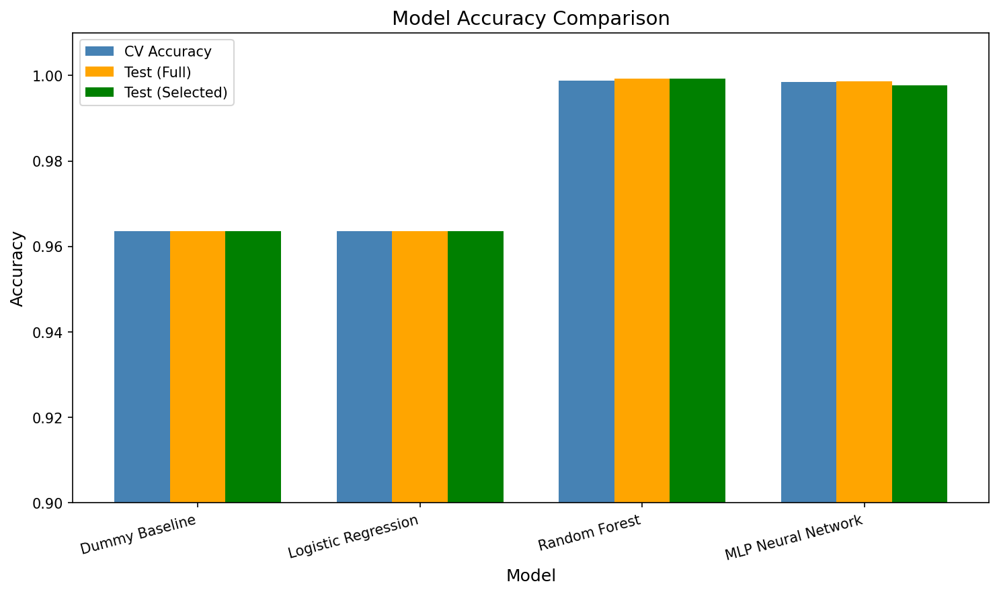
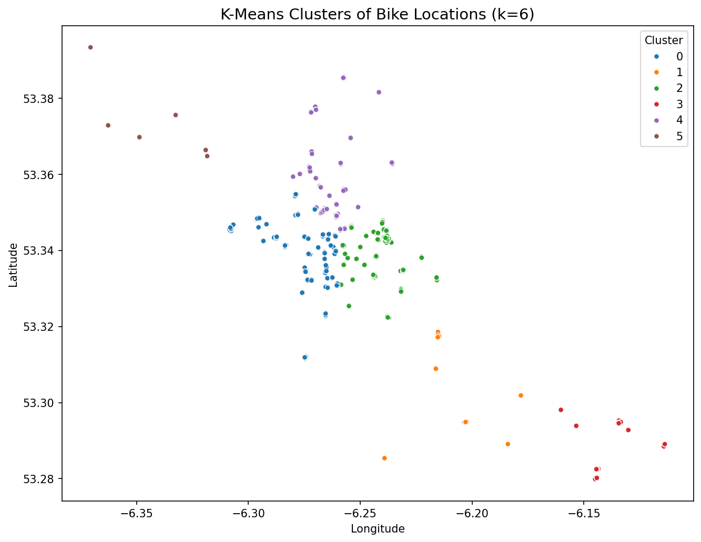
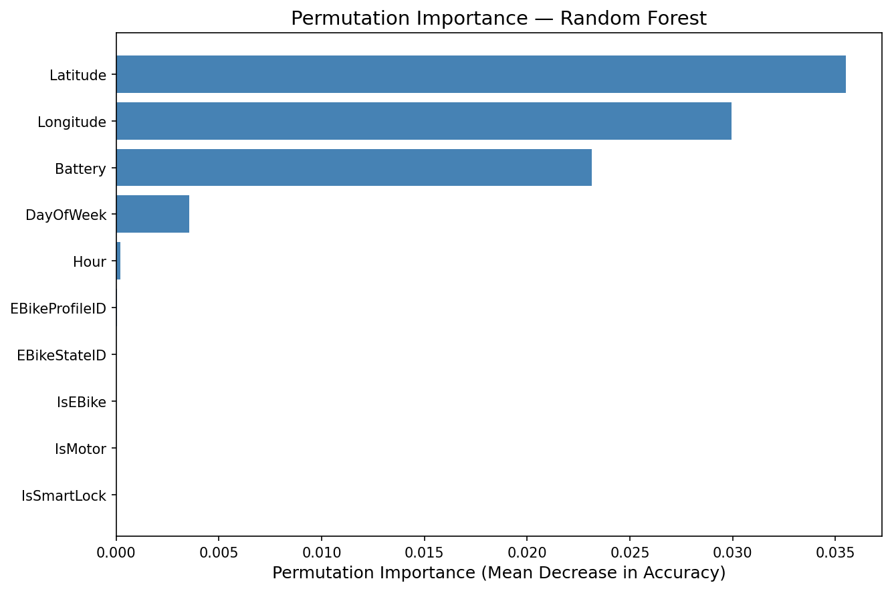
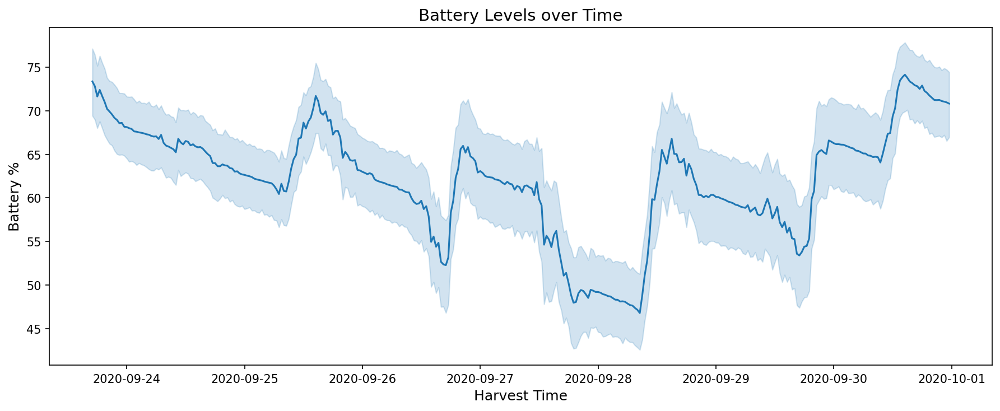
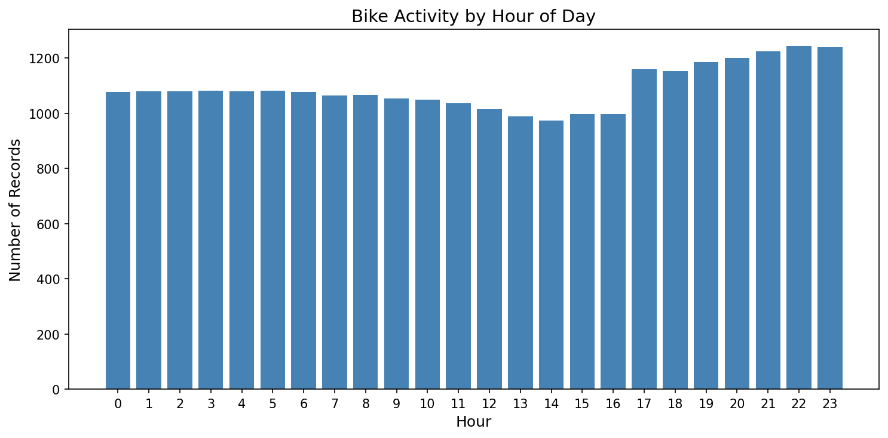
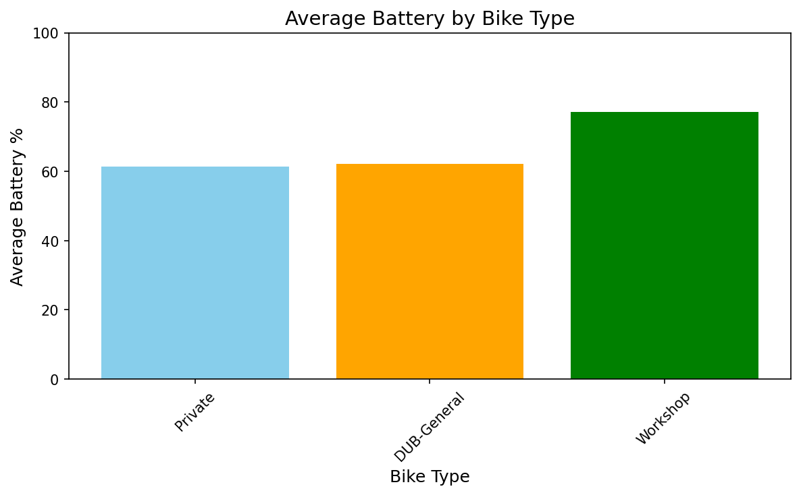
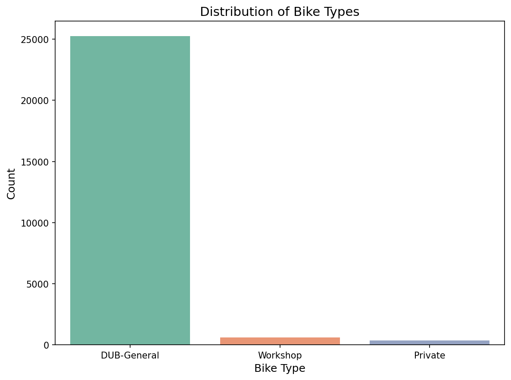
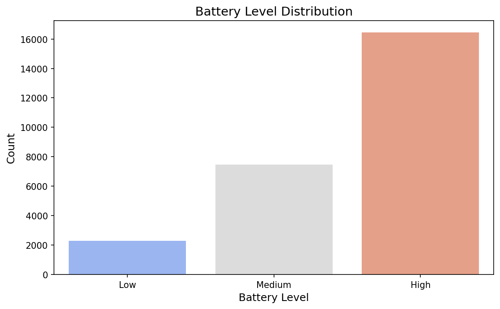
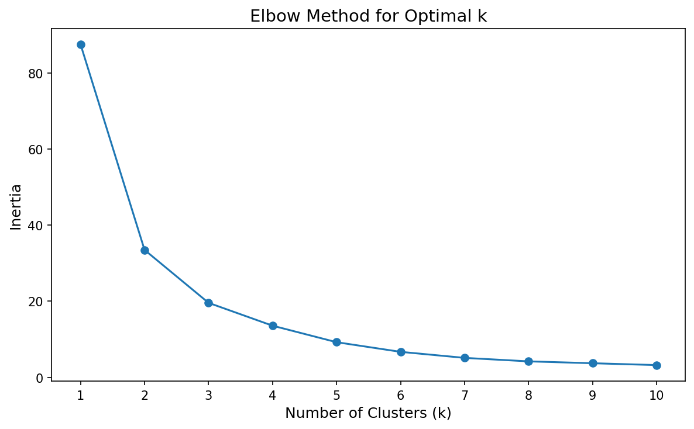
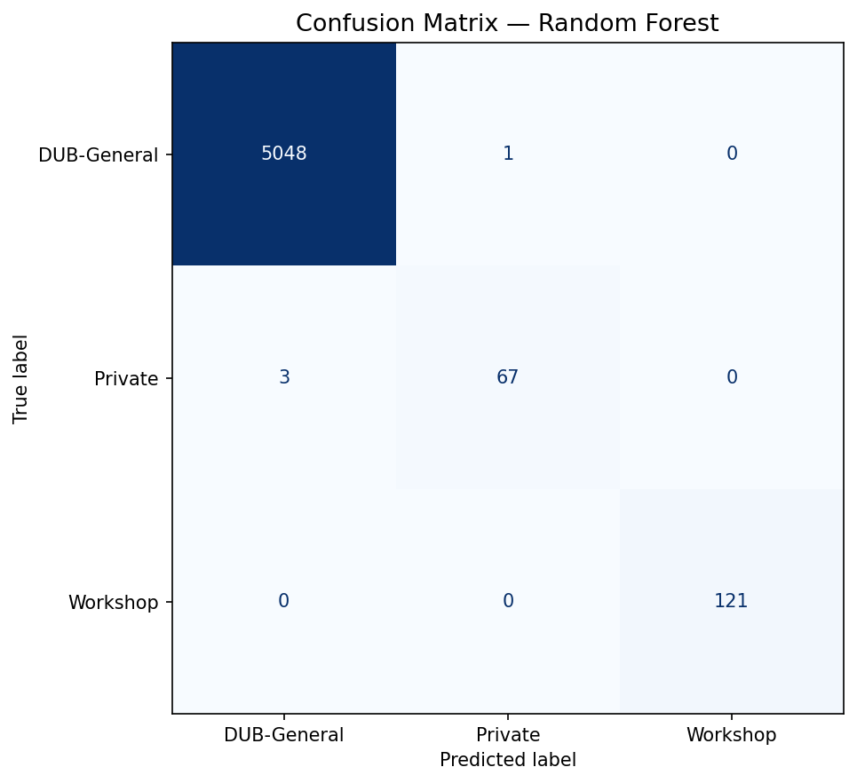

# Moby Bikes Dublin — Data Analytics CA2

Exploratory data analysis and machine learning classification on the Moby Bikes Dublin e-bike fleet dataset (September 2020).

---

## Project Overview

This project analyses a week of real-time GPS and battery telemetry data collected from Moby Bikes' Dublin fleet. The goal is to:

- Understand battery usage patterns across different bike types and times of day
- Identify geographic clusters of bike activity in Dublin
- Build and compare classification models to predict bike type from telemetry features

---

## Dataset

**File:** `moby-bikes-historical-data-092020.csv`  
**Period:** 23 September 2020 – 30 September 2020  
**Raw rows:** 27,253  |  **After cleaning:** ~26,200  
**Source:** Moby Bikes historical data export

| Column | Description |
|---|---|
| HarvestTime | Timestamp of the data snapshot |
| BikeID | Unique bike identifier |
| Battery | Battery level (%) |
| BikeTypeName | Bike category: DUB-General, Workshop, Private |
| EBikeProfileID | E-bike profile identifier |
| EBikeStateID | E-bike operational state |
| IsEBike / IsMotor / IsSmartLock | Boolean flags |
| Latitude / Longitude | GPS coordinates |

---

## Notebook Structure (`main.ipynb`)

| Section | What it does |
|---|---|
| Importing Libraries | All dependencies in one cell |
| Loading the Dataset | Read CSV, initial inspection |
| Exploratory Data Analysis | Shape, dtypes, missing values, distributions |
| Data Cleaning | Fill missing Battery, remove invalid GPS & negative battery |
| Feature Engineering | Extract `Hour` and `DayOfWeek` from `HarvestTime`; categorise battery into Low / Medium / High |
| Visualisations | Average battery by type, battery over time, bike type distribution, battery level distribution, hourly activity |
| K-Means Clustering | Elbow method to justify k=6; scatter plot of geographic clusters |
| Model Creation | Train/test split (80/20, stratified); `build_pipeline` helper |
| Baseline Model | `DummyClassifier` (most-frequent strategy) |
| Logistic Regression | 10-fold stratified CV + test accuracy |
| Random Forest | 10-fold stratified CV + test accuracy |
| MLP Neural Network | 10-fold stratified CV + test accuracy |
| Feature Selection | Random Forest feature importances → top 5 features |
| Models on Top Features | All three models re-trained on selected features |
| Model Comparison | Summary table + grouped bar chart |
| Classification Report | Precision, recall, F1 per class for best model |
| Confusion Matrix | Visual confusion matrix for Random Forest |
| Permutation Importance | Mean decrease in accuracy for each feature |

---

## Results Summary

| Model | CV Accuracy | Test Accuracy (Full) |
|---|---|---|
| Dummy Baseline | ~96.4% | ~96.4% |
| Logistic Regression | ~96.4% | ~96.4% |
| **Random Forest** | **~99.8%** | **~99.9%** |
| MLP Neural Network | ~99.3% | ~99.5% |

**Random Forest is the best-performing model.**  
Top predictive features: `Latitude`, `Longitude`, `Battery`, `EBikeStateID`, `EBikeProfileID`.

---

## Charts

### Model Accuracy Comparison


### K-Means Clusters of Bike Locations


### Permutation Importance


### Battery Levels over Time


### Bike Activity by Hour of Day


### Average Battery by Bike Type


### Distribution of Bike Types


### Battery Level Distribution


### Elbow Method for Optimal k


### Confusion Matrix — Random Forest


---

## Setup & Running

### 1. Clone the repository

```bash
git clone https://github.com/srini141202/DA_CA2.git
cd DA_CA2
```

### 2. Create a virtual environment (recommended)

```bash
python -m venv venv
# Windows
venv\Scripts\activate
# macOS / Linux
source venv/bin/activate
```

### 3. Install dependencies

```bash
pip install -r requirements.txt
```

### 4. Add the dataset

Download `moby-bikes-historical-data-092020.csv` from the Moby Bikes data export and place it in the `data/` folder:

```
DA_CA2/
└── data/
    └── moby-bikes-historical-data-092020.csv
```

### 5. Launch Jupyter and run the notebook

```bash
jupyter notebook main.ipynb
```

Run all cells top-to-bottom (`Kernel > Restart & Run All`).

---

## Repository Structure

```
DA_CA2/
├── main.ipynb                            # Main analysis notebook
├── requirements.txt                      # Python dependencies
├── .gitignore                            # Files excluded from git
├── README.md                             # This file
├── data/
│   └── moby-bikes-historical-data-092020.csv  # Not committed — see .gitignore
└── *.png                                 # Charts generated by running the notebook
```

---

## Dependencies

| Package | Version |
|---|---|
| Python | 3.13+ |
| pandas | 2.3.3 |
| numpy | 2.3.5 |
| matplotlib | 3.10.6 |
| seaborn | 0.13.2 |
| scikit-learn | 1.7.2 |
| jupyter | 1.1.1 |
| notebook | 7.4.5 |
