# Moby Bikes Dublin — Data Analysis

Exploratory data analysis, geospatial clustering and machine learning classification on the Moby Bikes Dublin e-bike fleet dataset (September 2020), including a bike-grouped evaluation that checks whether the classifiers work on bikes they have never seen.

---

## Project Overview

This project analyses a week of real-time GPS and battery telemetry data collected from Moby Bikes' Dublin fleet. The goal is to:

- Understand battery usage patterns across different bike types and times of day
- Identify geographic clusters of bike activity in Dublin
- Build and compare classification models to predict bike type from telemetry features
- Check how those models perform on unseen bikes (`main_grouped.ipynb`)

---

## Dataset

**File:** `moby-bikes-historical-data-092020.csv`  
**Data source:** Smart Dublin, Moby Bikes historical data (092020): https://data.smartdublin.ie/dataset/moby-bikes  
**Period:** 23 September 2020 – 30 September 2020 (350 snapshots, roughly every 30 minutes)  
**Raw rows:** 27,253  |  **After cleaning:** 26,200 rows from 89 bikes

| Column | Description |
|---|---|
| HarvestTime | Timestamp of the data snapshot |
| BikeID | Unique bike identifier |
| Battery | Battery level (%) |
| BikeTypeName | Bike category: DUB-General, Workshop, Private |
| EBikeProfileID | E-bike profile identifier |
| EBikeStateID | E-bike operational state |
| IsEBike / IsMotor / IsSmartLock | Boolean flags |
| Latitude / Longitude | GPS coordinates |

**Class balance after cleaning** (from `main_grouped.ipynb`):

| BikeTypeName | Rows | Share of rows | Distinct bikes |
|---|---|---|---|
| DUB-General | 25,244 | 96.35% | 85 |
| Workshop | 607 | 2.32% | 3 |
| Private | 349 | 1.33% | 1 |

---

## Notebook Structure

### `main.ipynb` (original analysis)

| Section | What it does |
|---|---|
| Importing Libraries | All dependencies in one cell |
| Loading the Dataset | Read CSV, initial inspection |
| Exploratory Data Analysis | Shape, dtypes, missing values, distributions |
| Data Cleaning | Fill missing Battery, remove invalid GPS & negative battery |
| Feature Engineering | Extract `Hour` and `DayOfWeek` from `HarvestTime`; categorise battery into Low / Medium / High |
| Visualisations | Average battery by type, battery over time, bike type distribution, battery level distribution, hourly activity |
| K-Means Clustering | Elbow method to justify k=6; scatter plot of geographic clusters |
| Model Creation | Train/test split (80/20, stratified, random by row); `build_pipeline` helper |
| Baseline Model | `DummyClassifier` (most-frequent strategy) |
| Logistic Regression | 10-fold stratified CV + test accuracy |
| Random Forest | 10-fold stratified CV + test accuracy |
| MLP Neural Network | 10-fold stratified CV + test accuracy |
| Feature Selection | Random Forest feature importances → top 5 features |
| Models on Top Features | All three models re-trained on selected features |
| Model Comparison | Summary table + grouped bar chart |
| Classification Report | Precision, recall, F1 per class for best model |
| Confusion Matrix | Visual confusion matrix for Random Forest |
| Permutation Importance | Mean decrease in accuracy for each feature |

### `main_grouped.ipynb` (evaluation on unseen bikes)

| Section | What it does |
|---|---|
| Load and clean | Same cleaning and features as `main.ipynb`; `BikeID` kept aside as the grouping key (not a feature) |
| Bikes behind the rows | Counts bikes, snapshots and bikes per class |
| Reference: random split | Re-runs the original 80/20 random row split and measures how many test rows come from bikes also in training |
| Grouped evaluation | `StratifiedGroupKFold` (5 folds, grouped by `BikeID`); every row is predicted by a model that never saw that bike |
| Results | Accuracy, macro-F1 and per-class recall for all four models; classification report and confusion matrix for Random Forest |
| Evaluability | Which classes can be evaluated on unseen bikes |

---

## Results Summary

### Random 80/20 row split (`main.ipynb`)

| Model | CV Accuracy | Test Accuracy (Full) |
|---|---|---|
| Dummy Baseline | 96.35% | 96.36% |
| Logistic Regression | 96.35% | 96.36% |
| Random Forest | 99.88% | 99.92% |
| MLP Neural Network | 99.85% | 99.87% |

> ⚠️ **These scores do not measure performance on new bikes.** The split is random by row, and every bike has hundreds of snapshots, so 100% of test rows come from bikes that are also in the training set (`main_grouped.ipynb`). The high accuracy comes from recognising individual bikes, mainly by their GPS position. See [Limitations](#limitations).

### Bike-grouped 5-fold evaluation (`main_grouped.ipynb`)

| Model | Accuracy | Macro-F1 | Recall DUB-General | Recall Private | Recall Workshop |
|---|---|---|---|---|---|
| Dummy Baseline | 96.35% | 0.3271 | 1.0000 | 0.0 | 0.0 |
| Logistic Regression | 96.35% | 0.3271 | 1.0000 | 0.0 | 0.0 |
| Random Forest | 96.14% | 0.3268 | 0.9978 | 0.0 | 0.0 |
| MLP Neural Network | 95.05% | 0.3249 | 0.9865 | 0.0 | 0.0 |

**On unseen bikes, no model beats the majority-class baseline.**

---

## Key Findings

All figures below are printed in the notebook outputs.

1. **The data is many snapshots of a few bikes.** The 26,200 cleaned rows come from 89 bikes over 350 snapshot times, with a median of 330 rows per bike. No bike changes type. (`main_grouped.ipynb`)
2. **The classes are highly imbalanced.** DUB-General makes up 96.35% of rows. Workshop is 3 bikes (607 rows) and Private is a single bike (349 rows). (`main_grouped.ipynb`)
3. **On the random row split, Random Forest reached 99.92% test accuracy** (CV 99.88%), against a 96.36% majority-class baseline. Logistic Regression did not improve on the baseline (96.36%). (`main.ipynb`)
4. **Location dominates the Random Forest.** Feature importances are Latitude 0.466, Longitude 0.312 and Battery 0.157. Everything else is below 0.04. Permutation importance gives the same top three: Latitude 0.035, Longitude 0.030, Battery 0.023. (`main.ipynb`)
5. **That accuracy does not carry over to new bikes.** In the original split, 100% of test rows belong to bikes also seen in training. With a split grouped by bike, Random Forest scores 96.14% accuracy and macro-F1 0.3268, slightly below the majority-class baseline (96.35%, macro-F1 0.3271). Recall for Workshop and Private is 0 for every model. (`main_grouped.ipynb`)
6. **Private cannot be evaluated on unseen bikes.** It is one bike, so whenever it is in the test fold the model has no Private rows to learn from. Workshop can be evaluated, but only on 3 bikes. (`main_grouped.ipynb`)
7. **Geographic clusters.** K-Means with k=6, chosen with the elbow method, splits the bike positions into clusters of 7,642 to 1,822 snapshots. (`main.ipynb`)

---

## Limitations

- **Small number of bikes.** The 26,200 rows come from only 89 bikes: 85 DUB-General, 3 Workshop and 1 Private. Results for the two minority classes rest on 1 to 3 bikes.
- **Random 80/20 row split.** `main.ipynb` splits rows at random, so the same bike appears in both training and test (100% of test rows). The 99.9% accuracy in the first results table reflects bike identity leaking across the split, not the ability to classify a new bike.
- **Majority-class baseline of 96.4%.** A model that always predicts DUB-General is already 96.35–96.36% accurate, so accuracy alone says little here. Macro-F1 and per-class recall are reported in `main_grouped.ipynb` for that reason.
- **Location features dominate.** Latitude and Longitude are the two most important features. Parked bikes report the same position across snapshots, which makes location a proxy for bike identity.
- **Private cannot be evaluated on unseen bikes**, because it is a single bike. Workshop results come from 3 bikes and are very uncertain.
- **One week of data** (23–30 September 2020), so the patterns may not hold for other periods.
- **Missing battery values** are filled with the median of the whole dataset before splitting, as in `main.ipynb`.

---

## Charts

### Model Accuracy Comparison (random row split)
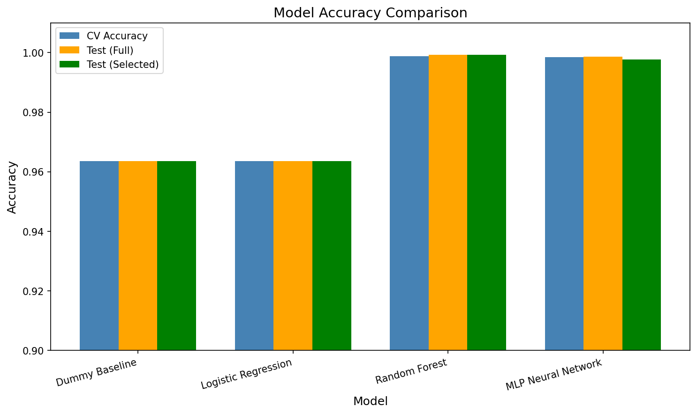

### Confusion Matrix — Random Forest, unseen bikes (grouped 5-fold)
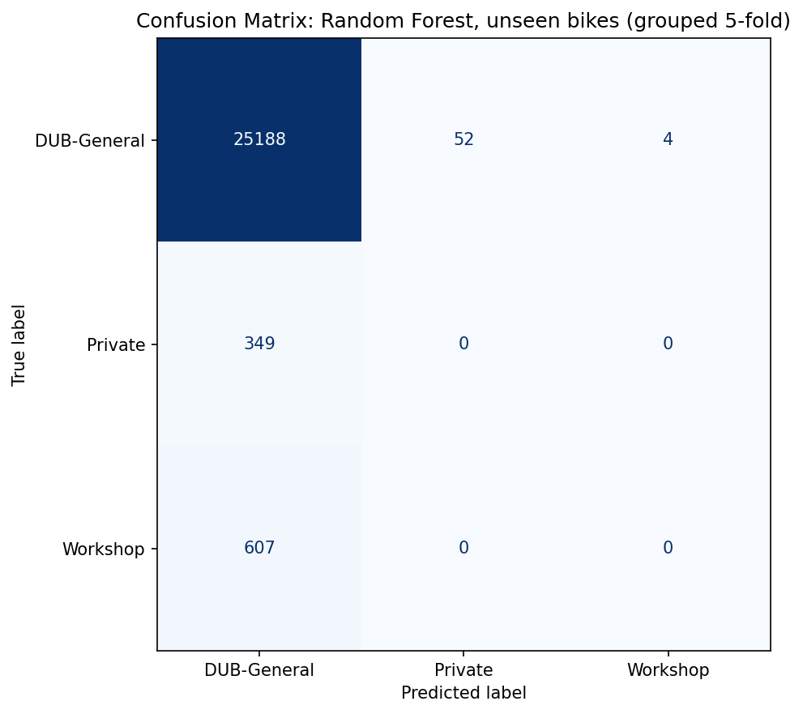

### Confusion Matrix — Random Forest, random row split
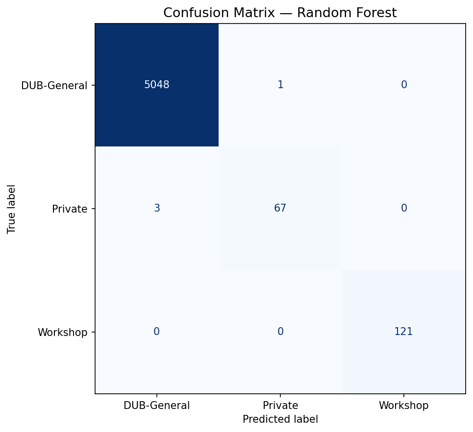

### K-Means Clusters of Bike Locations
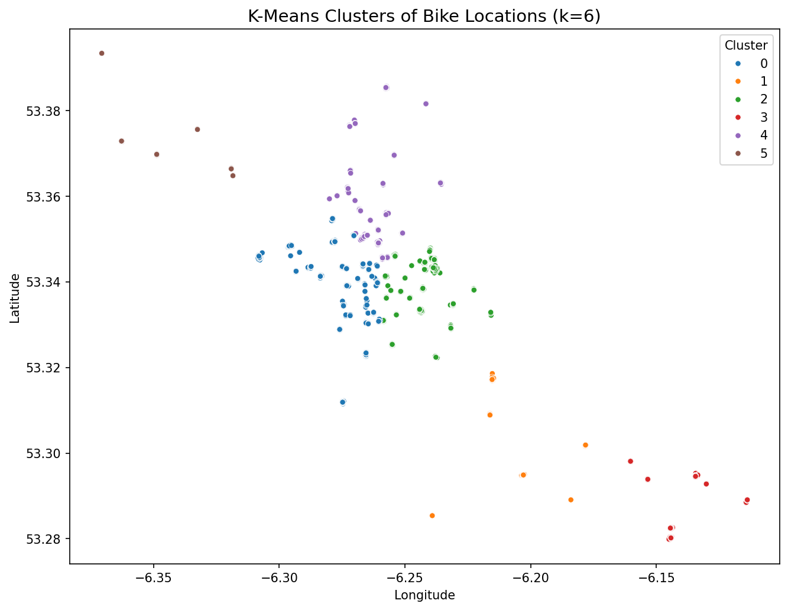

### Permutation Importance
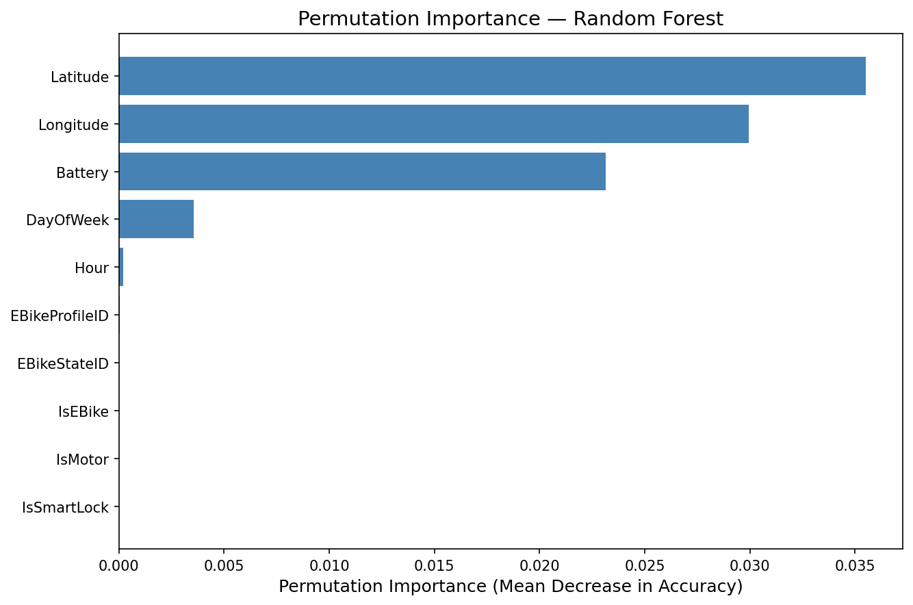

### Battery Levels over Time
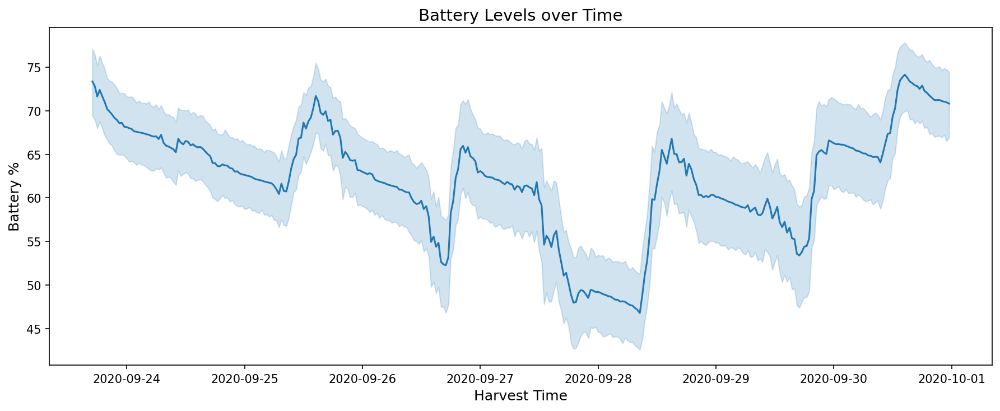

### Bike Activity by Hour of Day
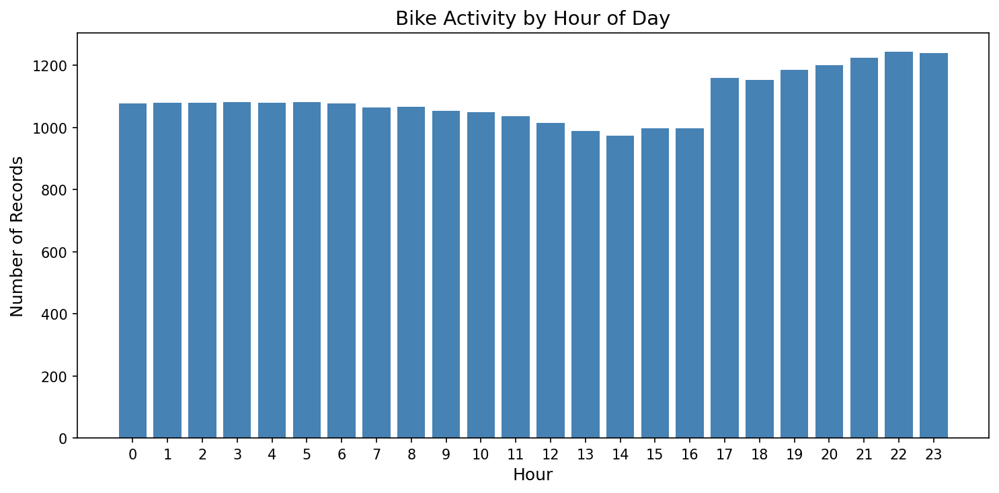

### Average Battery by Bike Type
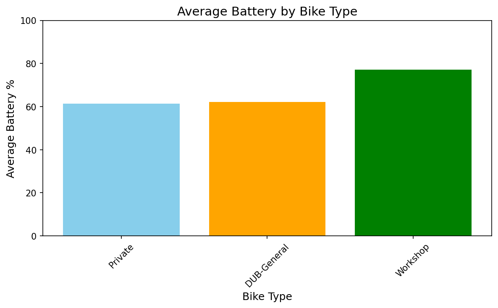

### Distribution of Bike Types
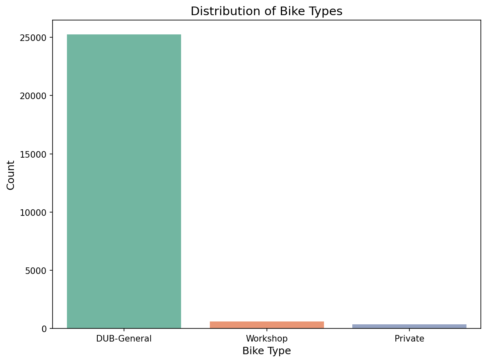

### Battery Level Distribution
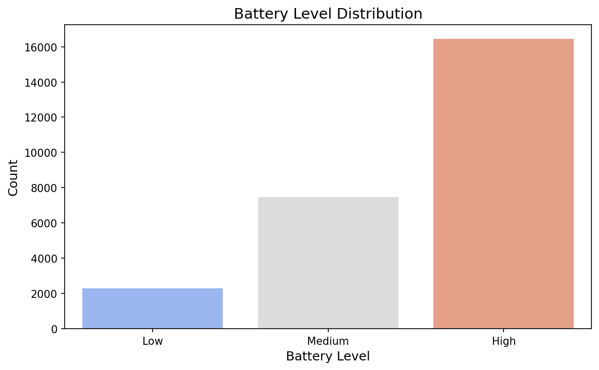

### Elbow Method for Optimal k
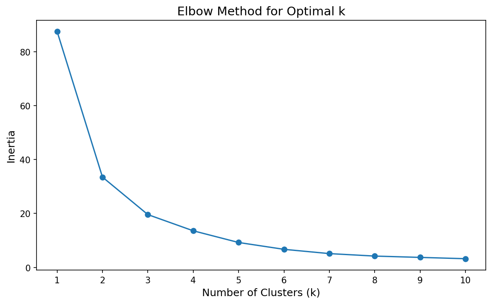

---

## Setup & Running

### 1. Clone the repository

```bash
git clone https://github.com/srini141202/moby-bikes-dublin-analysis.git
cd moby-bikes-dublin-analysis
```

### 2. Create a virtual environment (recommended)

```bash
python -m venv venv
# Windows
venv\Scripts\activate
# macOS / Linux
source venv/bin/activate
```

### 3. Install dependencies

```bash
pip install -r requirements.txt
```

### 4. Add the dataset

Download `moby-bikes-historical-data-092020.csv` from Smart Dublin (https://data.smartdublin.ie/dataset/moby-bikes) and place it in the `data/` folder:

```
moby-bikes-dublin-analysis/
└── data/
    └── moby-bikes-historical-data-092020.csv
```

### 5. Launch Jupyter and run the notebooks

```bash
jupyter notebook main.ipynb
jupyter notebook main_grouped.ipynb
```

Run all cells top-to-bottom (`Kernel > Restart & Run All`). Both notebooks save their charts to `figures/`.

---

## Repository Structure

```
moby-bikes-dublin-analysis/
├── main.ipynb                            # Main analysis notebook
├── main_grouped.ipynb                    # Evaluation on unseen bikes (split grouped by BikeID)
├── requirements.txt                      # Python dependencies
├── .gitignore                            # Files excluded from git
├── README.md                             # This file
├── figures/                              # Charts generated by the notebooks
│   └── *.png
└── data/
    └── moby-bikes-historical-data-092020.csv  # Not committed — see .gitignore
```

---

## Dependencies

| Package | Version |
|---|---|
| Python | 3.13+ |
| pandas | 2.3.3 |
| numpy | 2.3.5 |
| matplotlib | 3.10.6 |
| seaborn | 0.13.2 |
| scikit-learn | 1.7.2 |
| jupyter | 1.1.1 |
| notebook | 7.4.5 |
